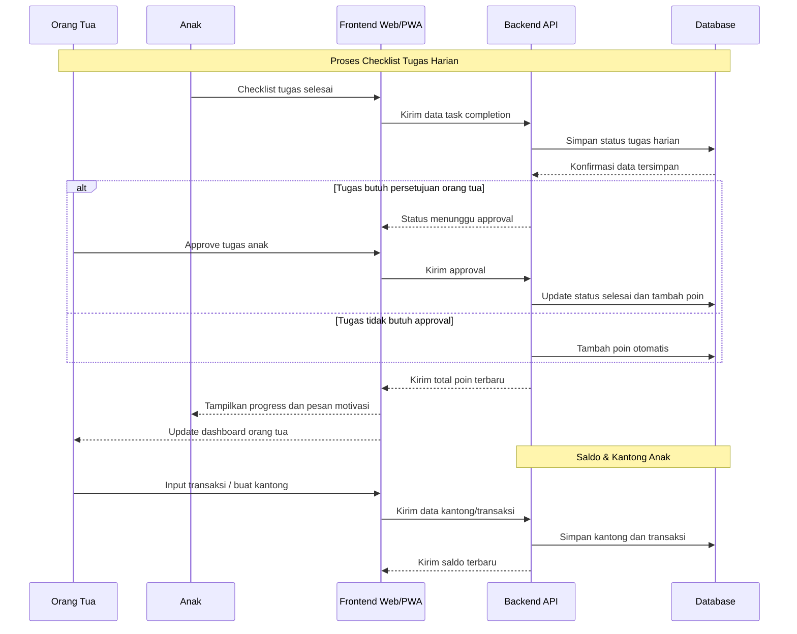

# PRD — Project Requirements Document

# Aplikasi MTRC Anak Usia 7 Tahun

## My Task Reward Chart

## 1. Overview

Aplikasi **MTRC — My Task Reward Chart** adalah aplikasi berbasis web/mobile yang membantu orang tua membuat, memantau, dan mengevaluasi tugas harian anak usia 7 tahun menggunakan sistem poin dan reward.

Masalah utama yang ingin diselesaikan adalah orang tua sering kesulitan membangun kebiasaan positif anak secara konsisten, seperti bangun pagi, mandi sendiri, merapikan mainan, belajar, membantu pekerjaan rumah ringan, dan tidur tepat waktu.

Aplikasi ini bertujuan menjadi alat bantu yang sederhana, menyenangkan, dan tidak menekan anak. Anak dapat melihat progress hariannya, mengumpulkan poin, dan mendapatkan reward yang telah disepakati bersama orang tua.

Fokus utama aplikasi bukan untuk menghukum anak, tetapi untuk membangun kebiasaan positif melalui apresiasi, visual progress, dan rutinitas yang mudah dipahami oleh anak usia 7 tahun.

---

## 2. Goals

Tujuan utama aplikasi:

1. Membantu orang tua membuat daftar tugas harian anak.
2. Membantu anak memahami tanggung jawab sederhana sesuai usianya.
3. Memberikan sistem poin dan reward yang mudah dipahami.
4. Menampilkan progress harian dan mingguan secara visual.
5. Membantu orang tua mengevaluasi kebiasaan anak dari waktu ke waktu.
6. Membuat proses pembentukan kebiasaan terasa menyenangkan, bukan seperti hukuman.

---

## 3. Requirements

Berikut adalah persyaratan tingkat tinggi untuk pengembangan sistem:

### 3.1 Platform

* Aplikasi dapat diakses melalui browser.
* Mobile friendly, karena kemungkinan besar digunakan orang tua melalui HP.
* Versi awal dapat dibuat sebagai web app/PWA.
* Anak dapat melihat tampilan sederhana tanpa banyak input kompleks.

### 3.2 Pengguna

Sistem memiliki dua jenis pengguna utama:

1. **Orang Tua**

   * Membuat dan mengatur tugas.
   * Memberikan poin.
   * Menentukan reward.
   * Melihat progress anak.

2. **Anak**

   * Melihat daftar tugas hari ini.
   * Melihat poin yang terkumpul.
   * Melihat reward yang bisa dicapai.
   * Menandai tugas selesai, jika diizinkan orang tua.

### 3.3 Data Input

Input utama dilakukan oleh orang tua:

* Nama anak.
* Usia anak.
* Daftar tugas harian.
* Poin setiap tugas.
* Target poin mingguan.
* Reward/hadiah.
* Catatan evaluasi harian.

Tambahan data finansial (opsional):

* Nama kantong/saldo (mis. "Kantong Gaji", "Kantong THR", "Kantong Investasi").
* Saldo awal tiap kantong.
* Transaksi kredit/debit (orang tua input; sumber: gaji, reward, transfer, pengeluaran).
* Kategori transaksi dan catatan.

### 3.4 Sistem Reward

* Setiap tugas memiliki nilai poin.
* Poin dihitung harian dan mingguan.
* Reward diberikan jika target poin tercapai.
* Reward dapat berupa aktivitas, makanan favorit, waktu bermain tambahan, atau hadiah kecil.
* Reward tidak disarankan berupa hukuman jika target tidak tercapai.

### 3.5 Batasan Usia

Aplikasi MVP difokuskan untuk anak usia 7 tahun.

Karakteristik desain harus:

* Sederhana.
* Menggunakan bahasa yang mudah dipahami anak.
* Banyak elemen visual.
* Tidak terlalu banyak teks.
* Tidak terlalu banyak menu.
* Tidak menggunakan sistem kompetisi berlebihan.

---

## 4. Core Features

Fitur utama yang harus ada dalam versi pertama aplikasi:

---

### 4.1 Dashboard Orang Tua

Dashboard untuk orang tua melihat kondisi keseluruhan anak.

Fitur:

* Total poin hari ini.
* Total poin minggu ini.
* Persentase target mingguan.
* Daftar tugas yang sudah selesai.
* Daftar tugas yang belum selesai.
* Reward yang sedang dikejar.
* Catatan perilaku anak hari ini.
* Riwayat progress 7 hari terakhir.

Contoh informasi dashboard:

* “Hari ini: 45/60 poin”
* “Minggu ini: 250/350 poin”
* “Reward minggu ini: Pilih film keluarga”
* “Tugas yang sering terlewat: Tidur tepat waktu”

---

### 4.2 Dashboard Anak

Dashboard khusus anak dengan tampilan lebih sederhana dan menyenangkan.

Fitur:

* Daftar tugas hari ini.
* Tombol checklist tugas.
* Tampilan bintang/poin.
* Progress bar menuju reward.
* Pesan motivasi positif.
* Ilustrasi atau ikon lucu.

Contoh pesan:

* “Hebat! Kamu sudah menyelesaikan 5 tugas hari ini.”
* “Sedikit lagi menuju reward minggu ini.”
* “Ayo rapikan mainan dulu, kamu bisa dapat 5 poin.”

---

### 4.3 Manajemen Anak

Orang tua dapat membuat profil anak.

Field:

* Nama anak.
* Usia.
* Foto/avatar.
* Target poin harian.
* Target poin mingguan.
* Preferensi reward.
* Status aktif/nonaktif.

Versi yang diperbarui harus mendukung multi-anak (multi-child) per akun orang tua. Orang tua dapat menambahkan beberapa profil anak, berpindah antar profil, dan melihat ringkasan keluarga.

---

### 4.4 Manajemen Tugas

Orang tua dapat membuat daftar tugas harian.

Field tugas:

* Nama tugas.
* Deskripsi singkat.
* Kategori tugas.
* Poin.
* Jadwal tugas.
* Status aktif/nonaktif.
* Apakah tugas perlu persetujuan orang tua.

Kategori tugas:

1. Kebersihan diri.
2. Kemandirian.
3. Belajar.
4. Tanggung jawab rumah.
5. Sikap/perilaku.
6. Rutinitas tidur.

Contoh tugas default untuk anak 7 tahun:

| Tugas                           | Poin |
| ------------------------------- | ---: |
| Bangun pagi tanpa rewel         |    5 |
| Merapikan tempat tidur          |    5 |
| Mandi dan gosok gigi sendiri    |    5 |
| Memakai baju sendiri            |    5 |
| Membereskan mainan              |    5 |
| Belajar/membaca 15 menit        |   10 |
| Membantu pekerjaan rumah ringan |   10 |
| Bicara sopan                    |   10 |
| Tidur tepat waktu               |   10 |

---

### 4.5 Checklist Harian

Fitur utama untuk menandai tugas yang selesai.

Fitur:

* Tugas muncul berdasarkan hari.
* Anak atau orang tua bisa checklist tugas.
* Jika tugas butuh validasi, poin masuk setelah disetujui orang tua.
* Sistem menghitung total poin otomatis.
* Tugas yang belum selesai tetap terlihat sampai akhir hari.
* Orang tua bisa menambahkan catatan.

Filter & rentang waktu:

* Orang tua bisa melihat checklist dan laporan per minggu dan per bulan (filter tanggal/pekan/bulan).
* Dashboard parent dapat diatur ke filter mingguan atau bulanan untuk melihat progress teragregasi.

Status tugas:

* Belum dikerjakan.
* Menunggu persetujuan.
* Selesai.
* Tidak selesai.

---

### 4.6 Sistem Poin

Setiap tugas memiliki poin.

Aturan:

* Poin hanya masuk jika tugas selesai.
* Poin harian dijumlahkan otomatis.
* Poin mingguan dijumlahkan otomatis.
* Orang tua dapat memberi bonus poin.
* Orang tua dapat mengurangi poin, tetapi sebaiknya tidak menjadi fitur utama agar aplikasi tidak terasa menghukum.

Fitur tambahan:

* Bonus poin untuk perilaku baik.
* Reset poin mingguan.
* Riwayat perubahan poin.
* Target poin harian dan mingguan.

Penambahan fitur finansial / saldo anak:

* Orang tua dapat menambahkan "kantong" saldo untuk tiap anak (multi kantong): contoh "Kantong Gaji", "Kantong THR", "Kantong Investasi".
* Kantong bersifat kustom: orang tua menentukan nama, tipe, dan saldo awal.
* Transaksi (kredit/debit) dapat ditambahkan oleh orang tua; reward dapat meng-trigger kredit otomatis ke kantong tertentu jika diatur.
* Dashboard anak menampilkan ringkasan saldo tiap kantong dan total saldo.
* Orang tua dapat memindahkan saldo antar kantong (transfer internal).
* Riwayat transaksi disimpan dan dapat difilter per minggu/bulan.

---

### 4.7 Manajemen Reward

Orang tua dapat membuat daftar reward.

Field reward:

* Nama reward.
* Deskripsi.
* Minimal poin.
* Tipe reward.
* Status aktif/nonaktif.

Tipe reward:

1. Aktivitas bersama orang tua.
2. Waktu bermain tambahan.
3. Pilih menu makanan.
4. Pilih film keluarga.
5. Mainan kecil.
6. Jalan-jalan kecil.

Contoh reward:

| Reward                  | Minimal Poin |
| ----------------------- | -----------: |
| Pilih menu sarapan      |           50 |
| Main 30 menit tambahan  |           60 |
| Pilih film keluarga     |           70 |
| Jalan-jalan akhir pekan |           85 |

---

### 4.8 Catatan Harian Orang Tua

Orang tua dapat menulis catatan harian.

Contoh catatan:

* “Hari ini anak semangat membereskan mainan.”
* “Masih perlu dibantu untuk tidur tepat waktu.”
* “Anak berhasil belajar 20 menit tanpa dipaksa.”

Catatan ini berguna untuk evaluasi mingguan.

---

### 4.9 Laporan Mingguan

Sistem menampilkan ringkasan mingguan.

Isi laporan:

* Total poin minggu ini.
* Tugas yang paling sering selesai.
* Tugas yang paling sering terlewat.
* Reward yang berhasil dicapai.
* Catatan orang tua.
* Rekomendasi tugas minggu depan.

Tambahan laporan finansial:

* Ringkasan transaksi mingguan dan bulanan per kantong.
* Kredit yang didapat dari reward atau gaji yang dikonversi menjadi saldo.
* Statistik pengeluaran dan saran budgeting (opsional untuk fase berikutnya).

Contoh insight:

* “Tugas belajar selesai 5 dari 7 hari.”
* “Tidur tepat waktu hanya tercapai 2 dari 7 hari.”
* “Anak lebih konsisten pada tugas pagi dibanding malam.”

---

## 5. User Flow

### 5.1 Flow Orang Tua Pertama Kali Menggunakan Aplikasi

1. Orang tua membuka aplikasi.
2. Orang tua membuat akun/login.
3. Orang tua membuat profil anak.
4. Sistem menawarkan template tugas default untuk anak usia 7 tahun.
5. Orang tua memilih tugas yang ingin digunakan.
6. Orang tua mengatur poin dan target mingguan.
7. Orang tua membuat reward.
8. Sistem menampilkan dashboard anak dan dashboard orang tua.

---

### 5.2 Flow Checklist Harian

1. Anak membuka halaman tugas hari ini.
2. Anak melihat daftar tugas.
3. Anak menyelesaikan tugas.
4. Anak menekan tombol checklist.
5. Jika tugas butuh validasi, status menjadi “Menunggu persetujuan”.
6. Orang tua menyetujui tugas.
7. Sistem menambahkan poin.
8. Progress reward diperbarui otomatis.

---

### 5.3 Flow Orang Tua Memberikan Reward

1. Orang tua membuka laporan mingguan.
2. Sistem menampilkan total poin anak.
3. Jika poin mencapai target, sistem menampilkan reward yang tersedia.
4. Orang tua memilih reward yang diberikan.
5. Sistem mencatat reward sebagai “Diberikan”.
6. Poin mingguan dapat direset untuk minggu berikutnya.

### 5.4 Flow Mengelola Saldo / Kantong Anak

1. Orang tua membuka halaman keuangan anak.
2. Orang tua menambahkan kantong baru (mis. Kantong Gaji) dan mengisi saldo awal.
3. Orang tua mencatat transaksi kredit (gaji/reward) atau debit (pengeluaran).
4. Sistem menyimpan transaksi dan memperbarui saldo kantong.
5. Anak melihat ringkasan saldo dan riwayat transaksi di dashboard mereka.

### 5.5 Flow Multi-Child

1. Orang tua menambahkan profil anak baru di menu "Anak".
2. Orang tua dapat berpindah antar profil untuk melihat tugas, poin, dan saldo masing-masing anak.
3. Laporan dan filter dapat diterapkan per anak atau untuk seluruh keluarga (aggregate).

---

## 6. Architecture

Berikut gambaran arsitektur sistem secara sederhana:



---

## 7. Database Schema

Berikut rancangan database awal untuk MVP aplikasi MTRC:

```mermaid
erDiagram
    users {
        int id PK
        string name
        string email
        string password_hash
        string role
        datetime created_at
        datetime updated_at
    }

    children {
        int id PK
        int parent_id FK
        string name
        int age
        string avatar
        int daily_point_target
        int weekly_point_target
        boolean is_active
        datetime created_at
        datetime updated_at
    }

    tasks {
        int id PK
        int child_id FK
        string title
        string description
        string category
        int point
        boolean requires_parent_approval
        boolean is_active
        datetime created_at
        datetime updated_at
    }

    daily_task_logs {
        int id PK
        int child_id FK
        int task_id FK
        date log_date
        string status
        int earned_point
        int approved_by FK
        datetime completed_at
        datetime approved_at
        datetime created_at
        datetime updated_at
    }

    rewards {
        int id PK
        int child_id FK
        string title
        string description
        string reward_type
        int required_point
        boolean is_active
        datetime created_at
        datetime updated_at
    }

    reward_claims {
        int id PK
        int child_id FK
        int reward_id FK
        int total_point_used
        int? pocket_id FK
        string status
        datetime claimed_at
        datetime given_at
        datetime created_at
        datetime updated_at
    }

    parent_notes {
        int id PK
        int child_id FK
        date note_date
        string note
        datetime created_at
        datetime updated_at
    }

    pockets {
        int id PK
        int child_id FK
        string name
        string type
        decimal initial_balance
        boolean is_active
        datetime created_at
        datetime updated_at
    }

    pocket_transactions {
        int id PK
        int pocket_id FK
        decimal amount
        string txn_type
        string source
        string note
        datetime created_at
        datetime updated_at
    }

    users ||--o{ children : "has many"
    children ||--o{ tasks : "has many"
    children ||--o{ daily_task_logs : "has many"
    tasks ||--o{ daily_task_logs : "tracked in"
    children ||--o{ rewards : "has many"
    rewards ||--o{ reward_claims : "claimed in"
    children ||--o{ parent_notes : "has many"
    children ||--o{ pockets : "has many"
    pockets ||--o{ pocket_transactions : "has many"
```

---

## 8. Database Table Explanation

| Tabel           | Deskripsi                                  |
| --------------- | ------------------------------------------ |
| users           | Data akun pengguna, terutama orang tua     |
| children        | Data profil anak                           |
| tasks           | Master tugas yang dibuat untuk anak        |
| daily_task_logs | Catatan tugas harian anak                  |
| rewards         | Daftar reward yang bisa dicapai anak       |
| reward_claims   | Riwayat reward yang diklaim atau diberikan |
| parent_notes    | Catatan evaluasi harian dari orang tua     |
| pockets         | Kantong saldo per anak (gaji, THR, dst.)   |
| pocket_transactions | Riwayat transaksi (kredit/debit) untuk tiap kantong |

---

## 9. MVP Scope

Fitur yang masuk versi MVP:

1. Login orang tua.
2. Profil anak.
2.1. Dukungan multi-anak dalam satu akun (tambah/edit/ganti profil anak).
3. Template tugas default anak usia 7 tahun.
4. CRUD tugas.
5. Checklist tugas harian.
6. Sistem poin harian dan mingguan.
7. CRUD reward.
8. Dashboard orang tua.
9. Dashboard anak sederhana.
10. Catatan harian orang tua.
11. Laporan mingguan sederhana.

---

## 10. Out of Scope MVP

Fitur yang tidak masuk versi pertama:
2. Leaderboard antar anak.
3. Chat dengan anak.
4. AI parenting assistant.
5. Notifikasi WhatsApp.
6. Integrasi sekolah.
7. Gamifikasi kompleks seperti level, badge, atau karakter RPG.
8. Marketplace reward.
9. Video edukasi.
10. Pembayaran/subscription.

Fitur tersebut dapat masuk ke fase berikutnya setelah MVP stabil.

---

## 11. Design & Technical Constraints

### 11.1 High-Level Technology

Sistem dapat dibangun menggunakan teknologi modern yang mudah dikembangkan dan dipelihara.

Rekomendasi stack:

* Frontend: Next.js App Ruter tailwind schadn-ui
* Backend: Next.js API
* Database: SQLite untuk MVP kecil
* Auth: Email, password dan integrasi dengan google
* Deployment: VPS atau shared hosting yang mendukung backend with docker
* Architecture code : Domain Driven Design

Jika ingin dibuat mobile friendly dan modern, bisa menggunakan Nuxt atau Next.js sebagai frontend.

---

### 11.2 UI/UX Rules

Aplikasi harus memiliki tampilan yang:

* Ceria tetapi tidak terlalu ramai.
* Mudah digunakan anak usia 7 tahun.
* Menggunakan ikon besar.
* Menggunakan tombol besar.
* Menghindari terlalu banyak teks.
* Menggunakan warna lembut.
* Menggunakan progress bar yang mudah dipahami.
* Memiliki tampilan berbeda antara mode orang tua dan mode anak.

---

### 11.3 Parent Mode

Mode orang tua harus lebih lengkap.

Menu parent mode:

1. Dashboard.
2. Anak.
3. Tugas.
4. Reward.
5. Checklist Harian.
6. Laporan.
7. Catatan.
8. Pengaturan.

---

### 11.4 Child Mode

Mode anak harus sangat sederhana.

Menu child mode:

1. Tugas Hari Ini.
2. Poin Saya.
3. Reward Saya.

Child mode tidak perlu menampilkan menu teknis seperti pengaturan, laporan, atau CRUD.

---

## 12. Success Metrics

Aplikasi dianggap berhasil jika:

1. Orang tua dapat membuat profil anak dalam waktu kurang dari 3 menit.
2. Orang tua dapat membuat atau memilih tugas default dengan mudah.
3. Anak dapat memahami daftar tugas tanpa bantuan berlebihan.
4. Orang tua dapat melihat progress harian dengan jelas.
5. Sistem poin berjalan otomatis tanpa perhitungan manual.
6. Laporan mingguan membantu orang tua mengevaluasi kebiasaan anak.
7. Anak merasa termotivasi, bukan merasa dihukum.

---

## 13. Suggested Default Data

### 13.1 Default Tasks Anak 7 Tahun

| Kategori    | Tugas                           | Poin |
| ----------- | ------------------------------- | ---: |
| Pagi        | Bangun pagi tanpa rewel         |    5 |
| Pagi        | Merapikan tempat tidur          |    5 |
| Kebersihan  | Mandi sendiri                   |    5 |
| Kebersihan  | Gosok gigi pagi dan malam       |    5 |
| Kemandirian | Memakai baju sendiri            |    5 |
| Rumah       | Membereskan mainan              |    5 |
| Belajar     | Membaca/belajar 15 menit        |   10 |
| Rumah       | Membantu pekerjaan rumah ringan |   10 |
| Sikap       | Bicara sopan                    |   10 |
| Malam       | Tidur tepat waktu               |   10 |

---

### 13.2 Default Rewards

| Reward                 | Minimal Poin |
| ---------------------- | -----------: |
| Pilih menu sarapan     |           50 |
| Main tambahan 30 menit |           60 |
| Pilih film keluarga    |           70 |
| Jalan-jalan kecil      |           85 |
| Beli mainan kecil      |          100 |

---

## 14. Roadmap

### Phase 1 — MVP

* Login orang tua.
* Profil anak.
* CRUD tugas.
* Checklist harian.
* Sistem poin.
* Reward.
* Dashboard.
* Laporan mingguan sederhana.

### Phase 2 — Gamification

* Badge.
* Level anak.
* Stiker digital.
* Avatar anak.
* Animasi saat tugas selesai.

### Phase 3 — Reminder

* Notifikasi harian.
* Reminder tidur.
* Reminder belajar.
* Reminder tugas rumah.

### Phase 4 — AI Assistant

* Rekomendasi tugas sesuai usia.
* Rekomendasi reward sehat.
* Insight kebiasaan anak.
* Saran komunikasi positif untuk orang tua.

### Phase 5 — Multi-Child & Family

* Multi anak dalam satu akun.
* Perbandingan progress tanpa kompetisi negatif.
* Role ayah/ibu.
* Export laporan PDF.

---

## 15. Acceptance Criteria

### 15.1 Login

* Orang tua bisa login menggunakan email dan password.
* Sistem menolak login jika email/password salah.
* Setelah login, user diarahkan ke dashboard.

### 15.2 Profil Anak

* Orang tua bisa membuat profil anak.
* Nama dan usia wajib diisi.
* Target poin harian dan mingguan bisa diatur.
* Profil anak bisa diedit.

### 15.3 Tugas

* Orang tua bisa membuat tugas baru.
* Tugas memiliki nama, kategori, poin, dan status aktif.
* Tugas bisa diedit dan dinonaktifkan.
* Tugas aktif muncul di checklist harian.

### 15.4 Checklist

* Anak/orang tua bisa checklist tugas.
* Sistem mencatat tanggal checklist.
* Sistem menghitung poin otomatis.
* Jika tugas butuh approval, poin masuk setelah disetujui orang tua.

### 15.5 Reward

* Orang tua bisa membuat reward.
* Reward memiliki minimal poin.
* Sistem menampilkan reward yang bisa dicapai anak.
* Reward dapat ditandai sebagai sudah diberikan.

### 15.6 Laporan

* Sistem menampilkan total poin mingguan.
* Sistem menampilkan tugas selesai dan tidak selesai.
* Sistem menampilkan reward yang tercapai.
* Sistem menampilkan catatan orang tua.

### 15.7 Saldo / Kantong (Finance)

* Orang tua dapat membuat kantong saldo untuk tiap anak.
* Orang tua dapat menambah saldo awal dan mencatat transaksi kredit/debit.
* Dashboard anak menampilkan saldo per kantong dan total saldo.
* Riwayat transaksi tersedia dan bisa difilter per minggu/bulan.

### 15.8 Filter Waktu

* Dashboard dan laporan dapat difilter berdasarkan minggu dan bulan.
* Parent dapat memilih rentang tanggal kustom untuk laporan.

---

## 16. Notes for Developer

Aplikasi harus dibuat dengan pendekatan sederhana terlebih dahulu. Jangan terlalu banyak fitur di awal.

Prioritas utama MVP:

1. Anak bisa melihat tugas.
2. Orang tua bisa mengatur tugas.
3. Sistem bisa menghitung poin.
4. Reward bisa dicapai dan dicatat.
5. Progress bisa dilihat harian dan mingguan.

Hindari fitur yang membuat aplikasi terasa seperti alat hukuman. Bahasa UI harus positif, misalnya:

* “Ayo coba lagi besok.”
* “Hari ini sudah bagus.”
* “Kamu hampir mencapai reward.”
* “Hebat, tugas selesai!”

Hindari kalimat seperti:

* “Kamu gagal.”
* “Poin dikurangi.”
* “Tidak boleh main.”
* “Target tidak tercapai.”
